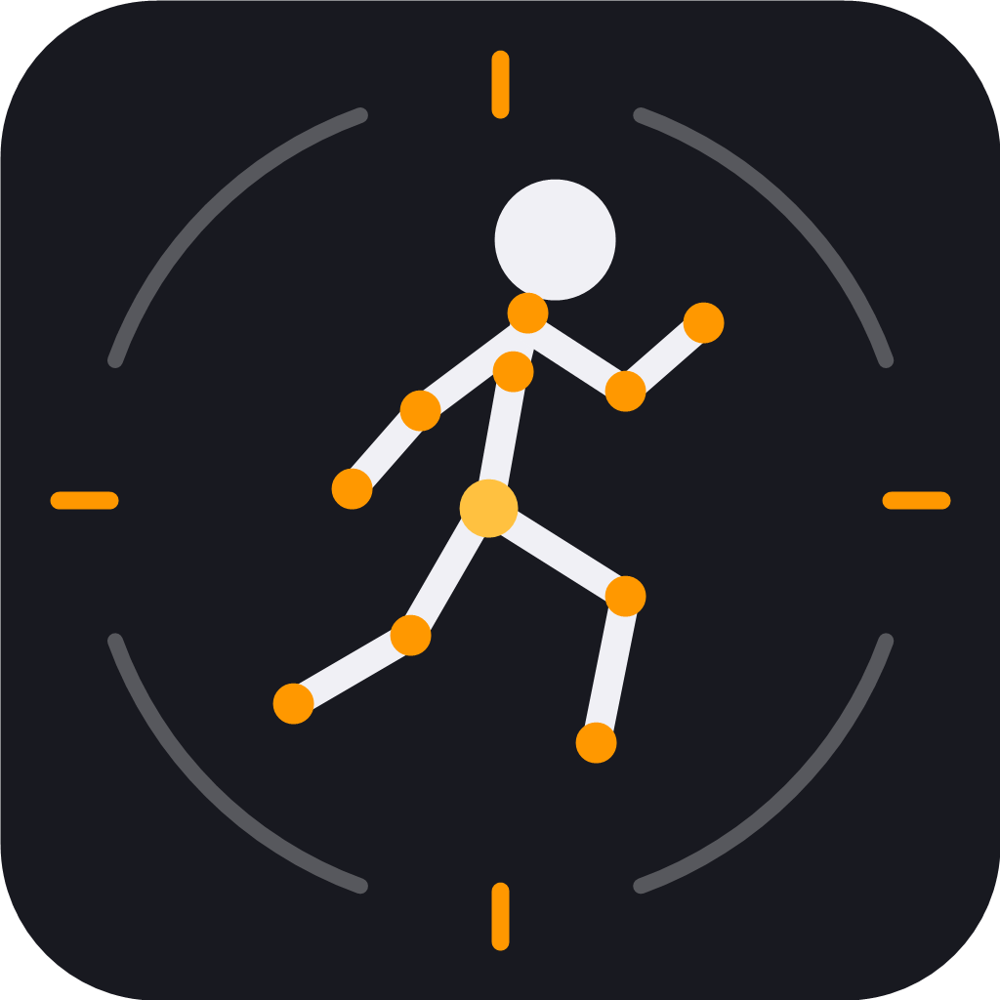

# Humanoid Retargeter

An [s&box](https://sbox.game) library that retargets skeletal animations from **any
humanoid rig onto any humanoid rig** — body, hands, feet, fingers, bone rolls, and root
motion — entirely inside the editor, in pure managed C#.

Drop in Mixamo, ActorCore/Character Creator, UE Mannequin, BVH mocap, or glTF animations
(or a rig the library has never seen) and get compiled, animgraph-ready s&box animations.

---

## Prerequisites

| Requirement | Notes |
|---|---|
| **s&box** (editor) | A current s&box install with the editor (`sbox-dev`). The library is editor-side; nothing runs at game runtime. |
| **A game project** | Conversions write into your project's `Assets/` folder. Any project works — including the shipped samples. The library refuses to modify engine-owned content (`addons/`, `core/`). |
| **This library installed** | Copy or clone this repository into your project's `Libraries/` folder (e.g. `Libraries/local.humanoid_retargeter/`). Only `Code/`, `Editor/`, `Assets/` and the `.sbproj` are needed. |
| Source animations | `.fbx` (binary or ASCII, FBX 7.x), `.bvh`, `.glb`, `.gltf`, `.vrm`, or RenderWare `.anm`/`.an5` files. FBX 6.x is rejected with a clear message — re-export from your DCC. |

No NuGet packages, no native DLLs, no Python, no external tools.

---

## Features

### Input
- **FBX** — own managed parser (binary + ASCII, v7000–7700): full pivot/PreRotation
  transform evaluation, all rotation orders, multi-take files, zlib-compressed curves.
- **BVH** — mocap files with any channel ordering; unit heuristics for meter/cm exports.
- **glTF / GLB / VRM** — node hierarchies, skins, animation samplers
  (linear/step/cubic-spline); a VRM's authored `humanoid.humanBones` map is used as the
  ground-truth mapping.
- **RenderWare `.anm` / `.an5`** — RW 3.x animation streams: single clips and
  multi-take `.an5` banks, uncompressed and rotation-only keyframe layouts. The animation carries no skeleton — place the
  character's model `.dff` next to the animation (or in its parent folder) and it is
  matched automatically by node count, or pick it explicitly on the file row.
- **Multi-take unpacking** — a file containing many animations expands into one list entry
  per take, each independently previewable, removable, and convertible.

### Rig understanding (automatic, per file)
- **Built-in profiles** (17): Mixamo, ActorCore / Character Creator (`CC_Base_*`),
  UE Mannequin (UE4/UE5 naming), Xsens MVN, Perception Neuron / Axis Neuron,
  Rokoko-style BVH, SMPL-X, SMPL, NVIDIA SOMA BVH, classic/Character-Studio BVH,
  Source ValveBiped (`ValveBiped.Bip01_*`), 3ds Max Biped (`Bip01`/`Bip001`),
  DAZ Genesis 3/8, DAZ/Poser classic, Blender Rigify (metarig + `DEF-`),
  VRoid/VRM (`J_Bip_*`), Auto-Rig Pro exports.
- **Your saved presets** — confirm a mapping once and that skeleton is recognized
  instantly forever (keyed by skeleton signature).
- **Auto-mapper** — token-based name matching for unlisted rigs (DAZ/Poser, 3ds Max
  Biped, CMU, …) with hierarchy validation.
- **Topology fallback** — maps rigs with meaningless bone names from the skeleton's
  shape alone (verified: recovers every role including all 30 finger phalanges on a
  fully renamed skeleton).
- **No-profile dialog** — when nothing matches confidently: auto-map blindly, use the
  deep-learning solver, or map manually. Batches may mix profiles freely.

### Retargeting
- **Geometric solver** (default): canonical anatomical frames built from rest geometry
  (immune to bone-roll conventions), A/T-pose rest normalization on both rigs, exact
  identity on same-rig round-trips (≤ 0.00025°), spine chain interpolation (3–5 source
  spine bones → target), finger curl/splay transfer, hip-height-scaled root translation.
- **Natural shoulder/neck/head/foot carriage** (option, on by default): clavicles, neck,
  head and feet keep the target body's own posture/skull/ankle anatomy and receive only
  the source's motion — fixes the slumped shoulders / hunched neck / bent-up planted feet
  look that exact direction-copying produces on differently-proportioned rigs. Toe-less
  sources automatically get the same treatment (no more heel-standing), and a source whose
  bind pose is itself posed (e.g. a fighting-stance rest with a chin-down head) automatically
  switches the head to follow the source's gaze instead of replaying deltas from that posed
  rest (no more "head looking up at an angle").
- **Deep-learning solver** (experimental): a pure-C# implementation of SAME
  (skeleton-agnostic motion embedding) running the pretrained checkpoint — no mapping
  needed at all. Offered in the no-profile dialog; after previewing, it can derive and
  save a regular profile from its own output so the rig switches to the deterministic
  geometric path. *(Weights ship in `Assets/humanoid_retargeter/dl/`; see ATTRIBUTION —
  CC BY-NC 4.0, non-commercial.)*
- **Cleanup passes**: Kovar foot-plant correction (anti foot-skate with plant detection,
  blending, and knee-pop-free stretch), grounded-foot stance recalibration (levels planted
  soles when a source ships a non-stance rest pose), optional arm effector IK, root motion
  keep / strip-in-place / extract-to-root.
- **s&box-exact IK helper bones**: `root_IK`, hand/foot IK targets, and `ikrule` bones are
  baked with the exact relationships Facepunch's own clips use (reverse-engineered to
  ~0.0001 cm) — retargeted clips drive the citizen animgraph like official animations.
  Twist/helper bones are correctly left to the model's own constraints.

### Targets
- **s&box Human** (default) — the 5-finger `citizen_human` rig.
- **s&box Citizen (classic)** — the 4-finger citizen; missing pinky roles are skipped
  cleanly.
- **Any custom humanoid** — pick any model/.vmdl or FBX as the target; its skeleton goes
  through the same detection/mapping machinery (best-effort even on imperfect matches).
  Engine-unit targets are handled with the correct axis/unit conventions automatically.

### Output
- **DMX animation files** (byte-compatible with s&box's own fbx2dmx output) plus either:
  - a **new animation vmdl** (s&box Base Model: your model keeps the mesh, the new vmdl
    holds the sequences), or
  - **augmentation of an existing vmdl** — non-destructive splice with a `.bak` backup,
    collision protection for your hand-authored entries, idempotent re-runs (re-converting
    updates entries in place), and automatic CopyPinky constraint neutralization when real
    pinky animation is present.
- **Batch conversion** — N files × all takes in one click, per-clip failure isolation,
  name-collision auto-suffixing, one combined vmdl.
- **Footstep events** (option) — `AE_FOOTSTEP` AnimEvents generated from the detected foot
  plants of each converted clip, in the exact node shape the shipped citizen data uses.
- **Mirrored variants** (option) — a left/right-mirrored twin of every clip (`<clip>_M`),
  mirrored in target space with IK helper bones re-baked from the mirrored body.

### Editor experience
- Dockable **Humanoid Retargeter** window (View menu): colored profile/status chips with
  confidence badges, per-row Mapping / Preview / Remove, compact stacked options panel
  (root motion, looping, foot-plant, carriage, footstep events, mirrored variants, arm IK,
  hip scales, sample fps), progress + per-clip compile status with real compiler errors
  surfaced.
- **Live preview** before anything is written — the actual skinned s&box model playing the
  retargeted clip, with play/pause/scrub and a **"Show source"** ghost overlay (the source
  clip as a semi-transparent stick skeleton, root-aligned and hip-height-scaled onto the
  target). Confirming offers **"Save as profile"**.
- **Asset browser integration** — right-click animation files → *Retarget Animation*.
- Code API: `Retargeter.Convert` / `ConvertBatch` / `Inspect` (engine-agnostic, bytes in,
  strings out).

---

## Quick start

1. Install the library (see prerequisites), open your project in the editor.
2. *View → Humanoid Retargeter*.
3. **Add Files…** (or right-click animation assets → *Retarget Animation*).
4. Check the profile chips — green is good to go; amber/red rows offer auto-map, DL, or
   manual mapping.
5. Optional: **Preview** any row on the real model.
6. Pick the target and output mode, hit **Convert All**.
7. The compiled sequences appear on the output model, ready for animgraph/`Sequence` use.

## Verification

Development is gated by 400+ unit/integration tests, an independent headless-Blender
harness that re-measures a 10-rig corpus (Mixamo, ActorCore, UE, CMU/DAZ BVH — anatomical
direction error, end-effector paths, foot contacts, jitter) with side-by-side renders, and
unattended editor-process gates that compile real output through `sbox-dev` and assert the
sequences, preview pose, and preset round-trip.

## Limitations

- Humanoid bipeds only (no quadrupeds/tails); facial/morph animation is not transferred.
- glTF with external `.bin` URIs isn't supported — use `.glb` (embedded) instead.
- FBX 6.x (2010-era) files are rejected; re-export as FBX 7.x.
- The DL solver ignores fingers (checkpoint limitation) and is weakest on hands — the
  geometric path remains the quality reference wherever a mapping exists.

## Attribution

The deep-learning mode implements **SAME** (Lee et al., *SAME: Skeleton-Agnostic Motion
Embedding for Character Animation*, SIGGRAPH Asia 2023), weights derived from the authors'
checkpoint — [github.com/sunny-Codes/SAME](https://github.com/sunny-Codes/SAME),
**CC BY-NC 4.0** (non-commercial). See `Assets/humanoid_retargeter/dl/ATTRIBUTION.md`.
